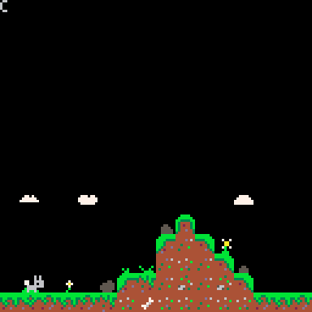
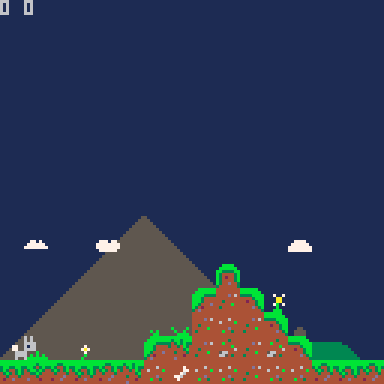
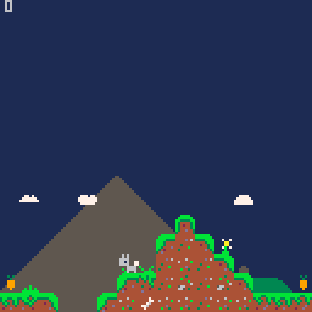
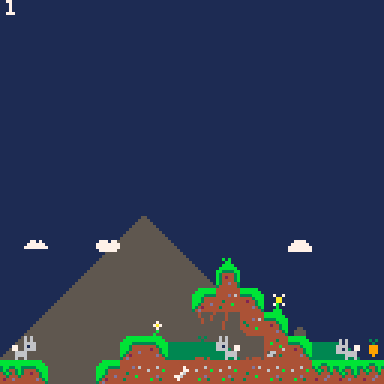

# Hararna från hopplösa

Gamejam: Spelsylt 6

Theme: Hopp

Description (swe): Hoppet har försvunnit från hararna i hopplösa. Det är ditt jobb att åter hitta hoppet. Hoppas det går.

Inspired by the [nerdy teachers platformer youtube tutorial](https://www.youtube.com/playlist?list=PLyhkEEoUjSQtUiSOu-N4BIrHBFtLNjkyE)

[play now on itch.io](https://madeso.itch.io/hararna-fran-harlosa)

# credits

* Programming, sfx and art - Gustav "madeso" Jansson
* Music - Stefan Forsberg

# log

day 1: made platformer basics and added art

day 2: added scrolling, fixed player collision issues, air friction, background image and exported playable to itch

day 3: added carrot pickups and falling outside

day 4: can talk to hares now.

late night day 4: swedish characters

day 5: playing looping music randomly, newlines and layout in dialog popup

day 6: fixed euclidian distance calculation overflowing by switching to manhattan distance. also implemented most of the story and level scripting